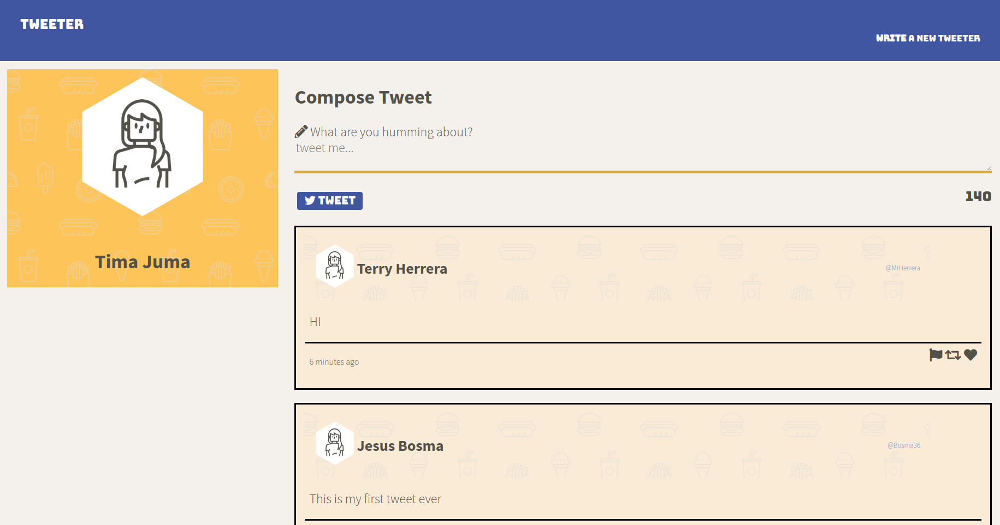
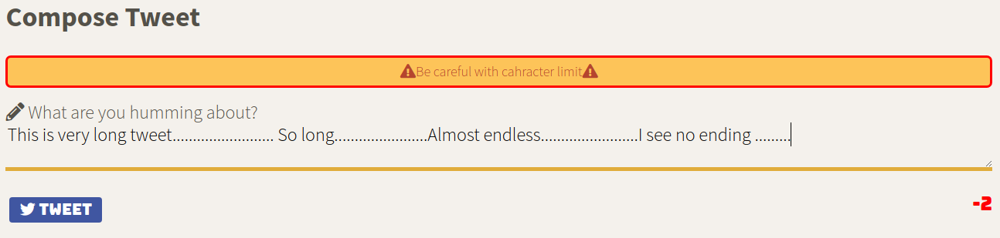
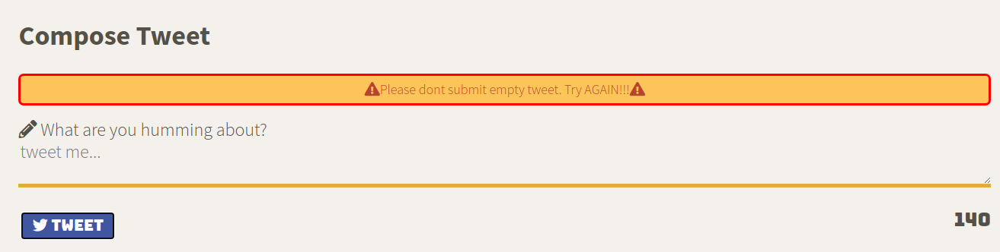

# Tweeter Project

Tweeter is a simple, single-page Twitter clone.

This repository is the starter code for the project: Students will fork and clone this repository, then build upon it to practice their HTML, CSS, JS, jQuery and AJAX front-end skills, and their Node, Express and MongoDB back-end skills.

## Getting Started

1. Fork this repository, then clone your fork of this repository.
2. Install dependencies using the `npm install` command.
3. Start the web server using the `npm run local` command. The app will be served at <http://localhost:4040/>.
4. Go to <http://localhost:4040/> in your browser.

## View of Final Product

- Screenshot of main page

Mobile View

error mesages

## Dependencies

- Express 4.13.x or above
- Node 5.10.x or above
- Body Parser
- Chance
- md5

 ## Features

 - If user submits an empty tweet, the inline alert message will be displayed
 - If user submits tweet with over 140 characters, the inline alert message will be displayed
 - The time of submission displayed in seconds, minutes, hours, days, depending how old is the tweet.
